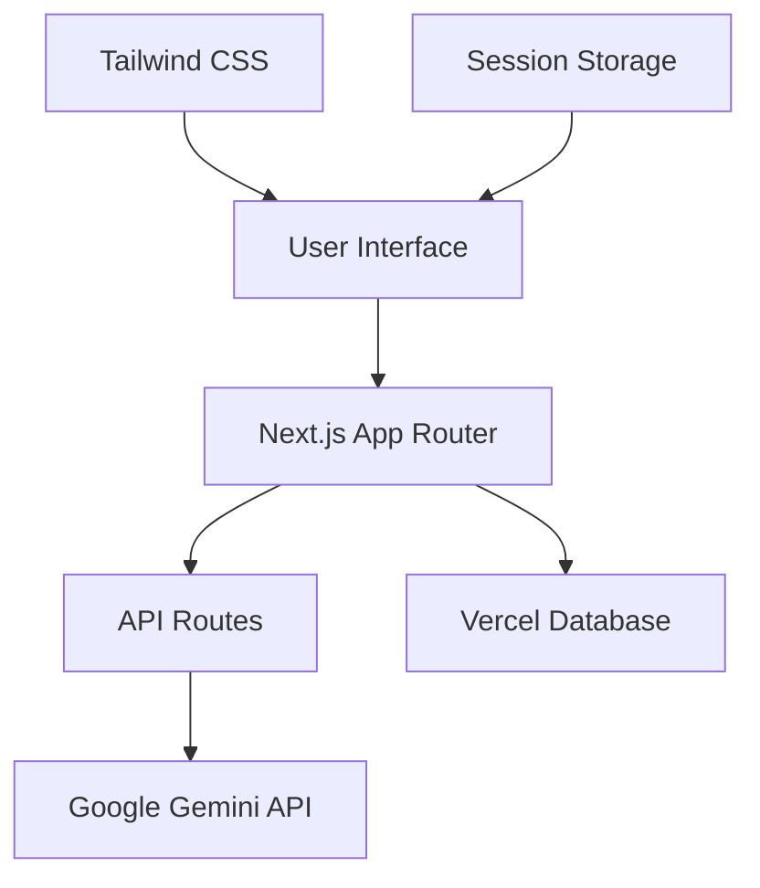

# Design Document

## Overview

The Email Template Generator is a Next.js 14+ application featuring a modern glass morphism design inspired by Apple's aesthetic. The application consists of two main features: template-based email enhancement and AI training for personalized email generation. The architecture emphasizes client-side processing for security, modern React patterns, and seamless integration with Google Gemini AI.

## Architecture

### High-Level Architecture



### Technology Stack

- **Frontend Framework**: Next.js 14+ with App Router
- **Styling**: Tailwind CSS with custom glass morphism components
- **Database**: Vercel Postgres for session management and analytics
- **AI Integration**: Google Gemini API via REST calls
- **Deployment**: Vercel platform
- **State Management**: React hooks and context for local state
- **Security**: Client-side API key storage, server-side validation

### Application Structure

```
src/
├── app/
│   ├── layout.tsx
│   ├── page.tsx
│   ├── template-enhancer/
│   │   └── page.tsx
│   ├── trainer/
│   │   └── page.tsx
│   └── api/
│       ├── gemini/
│       │   └── route.ts
│       └── health/
│           └── route.ts
├── components/
│   ├── ui/
│   │   ├── GlassCard.tsx
│   │   ├── GlassButton.tsx
│   │   ├── LoadingSpinner.tsx
│   │   └── ErrorMessage.tsx
│   ├── ApiKeyInput.tsx
│   ├── TemplateSelector.tsx
│   ├── EmailEditor.tsx
│   └── TrainerInterface.tsx
├── lib/
│   ├── gemini.ts
│   ├── database.ts
│   └── utils.ts
└── styles/
    └── globals.css
```

## Components and Interfaces

### Core Components

#### 1. GlassCard Component
- **Purpose**: Reusable glass morphism container
- **Props**: `children`, `className`, `blur`, `opacity`
- **Features**: Backdrop blur, subtle borders, gradient backgrounds

#### 2. ApiKeyInput Component
- **Purpose**: Secure API key input and validation
- **State**: API key, validation status, error messages
- **Features**: Input masking, format validation, secure storage

#### 3. TemplateSelector Component
- **Purpose**: Template selection interface
- **Props**: `selectedTemplate`, `onTemplateChange`
- **Templates**: Professional, Friend, Polite, Direct, Follow-up, Reminder
- **Features**: Single selection, visual feedback, descriptions

#### 4. EmailEditor Component
- **Purpose**: Email input and output display
- **Props**: `value`, `onChange`, `placeholder`, `readOnly`
- **Features**: Auto-resize textarea, character count, copy functionality

#### 5. TrainerInterface Component
- **Purpose**: AI training input/output interface
- **State**: Training input, training output, test input, generated output
- **Features**: Multi-step form, example validation, result display

### API Interfaces

#### Gemini API Integration
```typescript
interface GeminiRequest {
  prompt: string;
  template?: EmailTemplate;
  trainingData?: {
    input: string;
    output: string;
  };
}

interface GeminiResponse {
  success: boolean;
  data?: string;
  error?: string;
}

enum EmailTemplate {
  PROFESSIONAL = 'professional',
  FRIEND = 'friend',
  POLITE = 'polite',
  DIRECT = 'direct',
  FOLLOWUP = 'followup',
  REMINDER = 'reminder'
}
```

#### Database Schema
```sql
-- Session tracking for analytics
CREATE TABLE sessions (
  id UUID PRIMARY KEY DEFAULT gen_random_uuid(),
  created_at TIMESTAMP DEFAULT NOW(),
  template_used VARCHAR(50),
  feature_used VARCHAR(50),
  success BOOLEAN
);

-- Error logging
CREATE TABLE error_logs (
  id UUID PRIMARY KEY DEFAULT gen_random_uuid(),
  created_at TIMESTAMP DEFAULT NOW(),
  error_type VARCHAR(100),
  error_message TEXT,
  user_agent TEXT
);
```

## Data Models

### Client-Side State Management

#### API Key Context
```typescript
interface ApiKeyContextType {
  apiKey: string | null;
  setApiKey: (key: string) => void;
  clearApiKey: () => void;
  isValid: boolean;
}
```

#### Template Enhancement State
```typescript
interface TemplateState {
  selectedTemplate: EmailTemplate | null;
  draftEmail: string;
  enhancedEmail: string | null;
  isLoading: boolean;
  error: string | null;
}
```

#### Trainer State
```typescript
interface TrainerState {
  trainingInput: string;
  trainingOutput: string;
  testInput: string;
  generatedOutput: string | null;
  isLoading: boolean;
  error: string | null;
}
```

### Prompt Engineering

#### Template Enhancement Prompts
```typescript
const TEMPLATE_PROMPTS = {
  professional: "Rewrite this email in a professional, formal tone suitable for office communication...",
  friend: "Rewrite this email in a friendly, casual tone suitable for personal communication...",
  polite: "Rewrite this email with extra politeness and courtesy...",
  direct: "Rewrite this email to be more direct and concise while maintaining professionalism...",
  followup: "Rewrite this email as a polite follow-up message...",
  reminder: "Rewrite this email as a gentle reminder..."
};
```

#### Training Prompt Template
```typescript
const TRAINING_PROMPT = `
Based on this input-output example:
Input: {trainingInput}
Output: {trainingOutput}

Please analyze the pattern and style, then apply the same transformation to this new input:
Input: {testInput}
Output:
`;
```

## Error Handling

### Client-Side Error Handling
- **API Key Validation**: Format checking, test API calls
- **Input Validation**: Email content length, required fields
- **Network Errors**: Retry logic, timeout handling
- **Rate Limiting**: Request throttling, user feedback

### Server-Side Error Handling
- **Gemini API Errors**: Status code handling, error message parsing
- **Database Errors**: Connection issues, query failures
- **Validation Errors**: Input sanitization, type checking

### Error Recovery Strategies
- **Graceful Degradation**: Fallback UI states
- **User Guidance**: Clear error messages, suggested actions
- **Logging**: Error tracking for debugging and analytics

## Testing Strategy

### Unit Testing
- **Components**: React Testing Library for UI components
- **Utilities**: Jest for helper functions and API utilities
- **API Routes**: Supertest for endpoint testing

### Integration Testing
- **API Integration**: Mock Gemini API responses
- **Database Integration**: Test database operations
- **End-to-End Flows**: Template enhancement and training workflows

### Performance Testing
- **Load Testing**: API endpoint performance under load
- **UI Performance**: Component rendering optimization
- **Bundle Analysis**: Code splitting and optimization

### Security Testing
- **API Key Handling**: Secure storage and transmission
- **Input Sanitization**: XSS and injection prevention
- **Rate Limiting**: API abuse prevention

## UI/UX Design Specifications

### Glass Morphism Design System

#### Color Palette
```css
:root {
  --glass-bg: rgba(255, 255, 255, 0.1);
  --glass-border: rgba(255, 255, 255, 0.2);
  --glass-shadow: rgba(0, 0, 0, 0.1);
  --accent-primary: #007AFF;
  --accent-secondary: #5856D6;
  --text-primary: #1D1D1F;
  --text-secondary: #86868B;
}
```

#### Glass Components
- **Backdrop Filter**: `backdrop-blur-xl`
- **Background**: Semi-transparent with subtle gradients
- **Borders**: 1px solid with low opacity
- **Shadows**: Soft, multi-layered shadows
- **Animations**: Smooth transitions and hover effects

#### Layout Structure
- **Header**: Glass navigation with logo and API key status
- **Main Content**: Centered glass cards with feature sections
- **Footer**: Minimal glass footer with attribution

### Responsive Design
- **Mobile**: Single column, touch-optimized buttons
- **Tablet**: Two-column layout for trainer feature
- **Desktop**: Full layout with side-by-side comparisons

## Performance Considerations

### Optimization Strategies
- **Code Splitting**: Route-based and component-based splitting
- **Image Optimization**: Next.js Image component with WebP
- **CSS Optimization**: Tailwind CSS purging and minification
- **API Caching**: Response caching for repeated requests

### Monitoring
- **Core Web Vitals**: LCP, FID, CLS tracking
- **API Performance**: Response time monitoring
- **Error Tracking**: Client and server error logging
- **Usage Analytics**: Feature usage and success rates